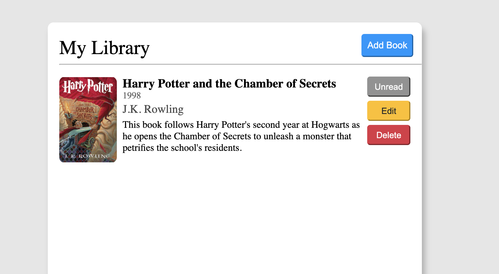

# Library

This is a Library Application where you can keep track of all the books you're reading.

> **Home page**

# 

## Table of contents

1. [Demo](#demo)
2. [Technologies](#technologies)
3. [Features](#features)

## Demo

Here is the working live demo:
[https://jkarjoo.github.io/library/](https://jkarjoo.github.io/library/)

## Technologies

- Javascript (ES6)

## Features

- Create books with a title, author, year published, description, and cover image
- Update/Edit books
- Delete books
- Mark books as read
